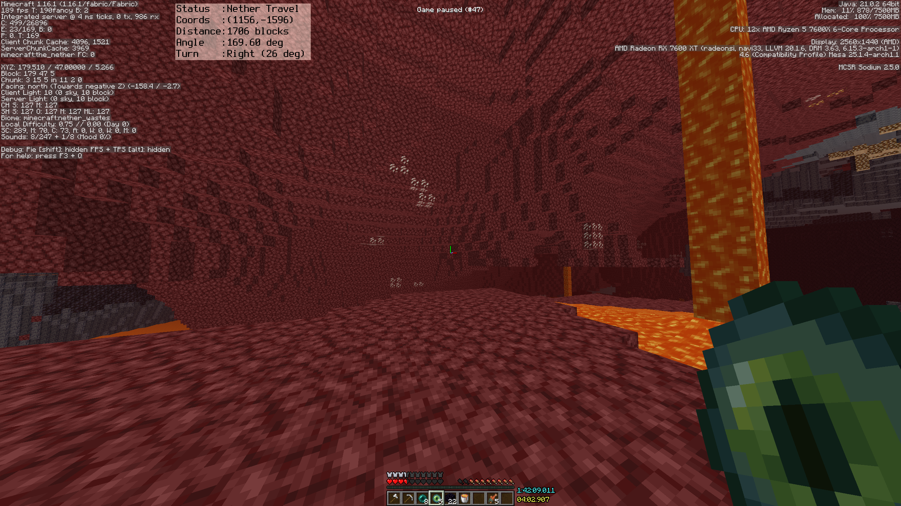

# Waywall Ninjabrain Overlay

A lightweight [Ninjabrain Bot](https://github.com/Ninjabrain1/Ninjabrain-Bot) overlay for [Waywall](https://github.com/tesselslate/waywall)

---

## Installation
- You must use Arsoniv's fork of Waywall for http requests (https://github.com/Arsoniv/waywall)
```bash
cd
git clone https://github.com/Arsoniv/waywall waywall_http
cd waywall_http
make
```
> It is suggested to clone this to a different directory such as waywall_http so you have a fallback if it doesn't work
- Change your wrapper command to use this fork `/home/<username>/waywall_http/build/waywall/waywall wrap --`
- Download the following files and place them in your Waywall config folder with `init.lua` (`~/.config/waywall/`):
  - `nb_overlay.lua`
  - `dkjson.lua`
  - `nb_background.png`

---

## Setup
### 1. Import the module

Add this line to your `init.lua` **before your `config.actions` section**:

```lua
local nb_overlay = require("nb_overlay")
```

### 2. Add keybindings

Add these binds to `config.actions`:

```lua
["*-C"] = function()
  if waywall.get_key("F3") then
    nb_overlay.enable_overlay()
    return false
  else
    return false
  end
end,

["<any key>"] = nb_overlay.disable_overlay,
```
> Replace `<any key>` with your preferred key for disabling the overlay.
**Do not change the key for `enable_overlay`** — it is designed to be triggered with `F3 + C` to ensure the overlay updates in sync with Minecraft.

### 3. Change the background path's username to your own in `nb_overlay.lua`
eg.
```lua
local nb_background_path = "/home/arjungore/.config/waywall/nb_background.png"
```
---

## Customization

### Overlay text appearance
Edit the `look` table in `nb_overlay.lua` to change the text's position, color, size, and boldness:

```lua
local look = {
    X = 500,
    Y = 10,
    color = '#000000',
    size = 2,
    bold = true,
}
```

### Background image
Replace `nb_background.png` with your own image.  

- It will be **automatically resized** to fit the overlay
- It's suggested to use a **solid color or minimal texture** — other pictures may look distorted when stretched

---
## Preview
<p align="center">
  
</p>
*Example overlay showing Nether travel prediction*

---

## Credits

- **Tesselslate** – creator of the original Waywall
- **Arsoniv** – developer of the Waywall fork with HTTP support
- **Ninjabrain** – creator of Ninjabrain bot

---
